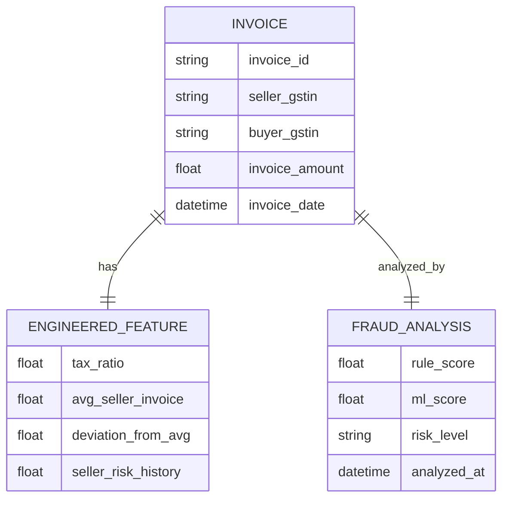
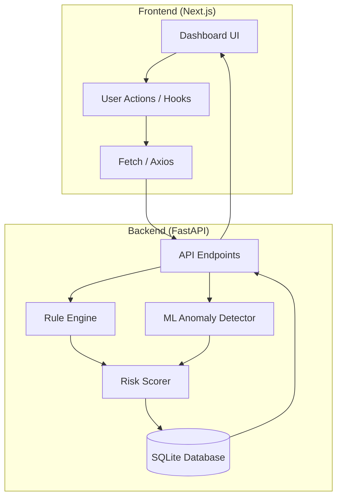

# GST Fraud Detection System (GST Shield)

An Intelligent GST Fraud Pattern Detection System designed to identify anomalies, evaluate risk, and visualize potential fraud in GST invoices using Rule-based validation and Machine Learning (Isolation Forest).

## 🚀 Features

- **Real-time Dashboard**: Overview of total invoices, fraud percentage, and risk distribution.
- **Anomaly Detection**: Using Isolation Forest algorithm to identify outliers in invoice data.
- **Rule Engine**: Customizable rules for validating GSTINs, amounts, and tax rates.
- **Risk Scoring**: Intelligent risk evaluation (High, Medium, Low) for every invoice.
- **Invoice Management**: Visual list of invoices with detailed risk analysis.
- **Data Generation**: Integrated sample data generator for testing and demonstration.

## 🏗️ Architecture

### Backend (FastAPI)
- **Framework**: FastAPI for high-performance Async API.
- **ML Engine**: Scikit-learn (Isolation Forest) for anomaly detection.
- **Rule Engine**: Logic-based validation layer.
- **Database**: SQLite (SQLAlchemy) for persistence.

### Frontend (Next.js)
- **Framework**: Next.js 15 (App Router).
- **Styling**: Tailwind CSS & Lucide Icons.
- **Visuals**: Recharts for data visualization.
- **Theme**: Premium dark-mode UI with glassmorphism effects.

## 🗄️ Database Schema



## 📊 Project Structure & Data Flow



## 🛠️ Setup Instructions

### Backend
1. Navigate to the `backend` directory:
   ```bash
   cd backend
   ```
2. Install dependencies:
   ```bash
   pip install -r requirements.txt
   ```
3. Start the server:
   ```bash
   uvicorn main:app --reload --port 8000
   ```

### Frontend
1. Navigate to the `frontend` directory:
   ```bash
   cd frontend
   ```
2. Install dependencies:
   ```bash
   npm install
   ```
3. Start the development server:
   ```bash
   npm run dev
   ```

## 📬 Contact

[Subhajit Das](https://github.com/Subhajit-Das-1)
